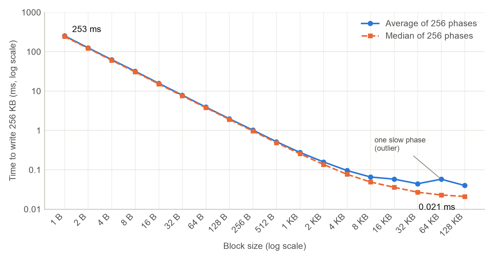
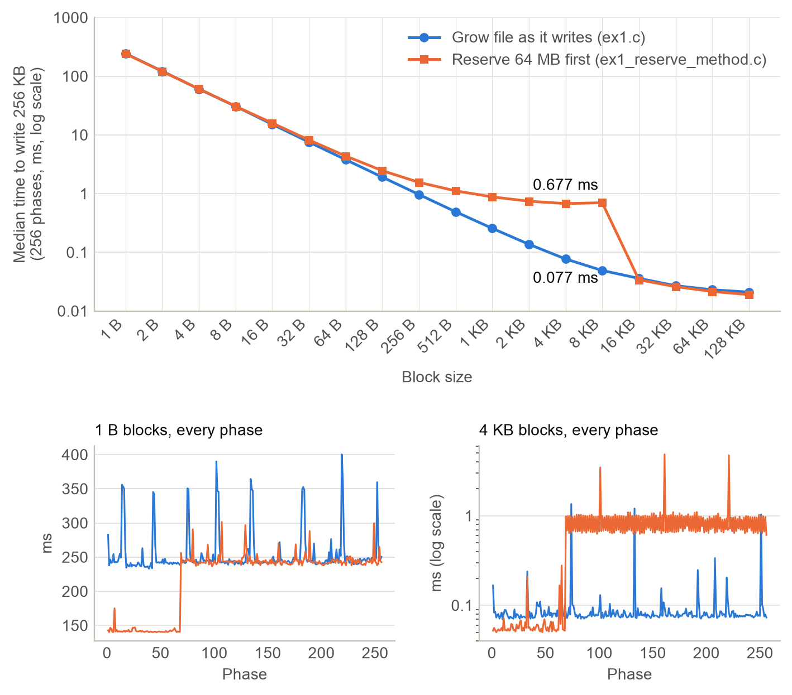
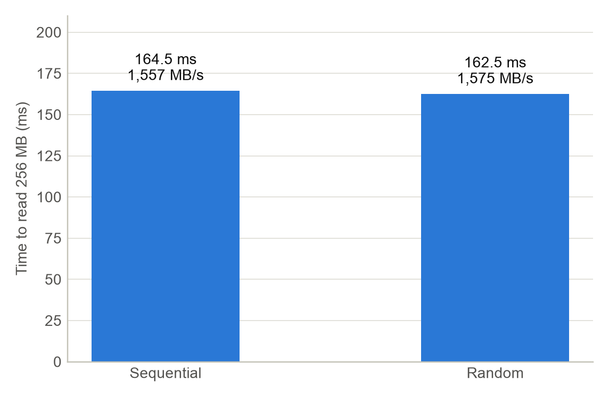

# HW1: File I/O Benchmark in C

Small C programs that measure raw file I/O using unbuffered system calls
(`open`, `write`, `read`, `lseek`, `close`), with no stdio buffering.

- **Experiment 1 (`ex1.c`)**: write time vs block size. Writes a 256 KB buffer to
  18 files using block sizes from 1 B (file `01`) to 128 KB (file `18`), 256 times.
- **Experiment 1, reserve method (`ex1_reserve_method.c`)**: same as `ex1.c`, but first
  reserves each file's final 64 MB on disk (`F_PREALLOCATE` + `ftruncate`; `posix_fallocate`
  on Linux), so `write()` fills space that already exists instead of growing the file.
- **Experiment 2 (`ex2.c`)**: sequential vs random reads. Builds a 256 MB file
  (`19`), then reads it start to end, then with 1,024 random 256 KB reads.

## Requirements

- A C compiler (`cc`, `clang` or `gcc`). On macOS: `xcode-select --install`.
- About 1.5 GB of free disk space while the programs run.
- macOS for accurate Experiment 2 results (see [Notes](#notes)).

## Run

```sh
cc -O2 -Wall -o ex1 ex1.c && ./ex1 > ex1.csv    # about 2 minutes, writes 1.15 GB
cc -O2 -Wall -o ex1_reserve_method ex1_reserve_method.c && ./ex1_reserve_method > ex1_reserve_method.csv    # about 2 minutes, writes 1.15 GB
cc -O2 -Wall -o ex2 ex2.c && ./ex2 > ex2.csv    # about 3 seconds, writes 256 MB
```

`ex1` and `ex1_reserve_method` print a progress counter and per-block-size averages to the
terminal. `ex1_reserve_method` also prints how long the reservation took (`reserve_ms`).

Draw the charts from the CSV files (needs `pip install matplotlib`):

```sh
python3 plot.py    # writes ex1_chart.png, ex2_chart.png and ex1_compare_chart.png
```

When finished, delete the data files:

```sh
rm 0[1-9] 1[0-9]
```

## Output

| File | Contents |
|---|---|
| `ex1.csv` | One row per phase per file: `phase,file,block_bytes,ms` (4,608 rows) |
| `ex1_reserve_method.csv` | Same format as `ex1.csv`, from `ex1_reserve_method` |
| `ex2.csv` | One row per test: `test,bytes,ms,MB_per_s` |
| `ex1_chart.png`, `ex2_chart.png` | Charts drawn by `plot.py` |
| `ex1_compare_chart.png` | `ex1` vs `ex1_reserve_method`, drawn by `plot.py` if `ex1_reserve_method.csv` exists |
| `01`–`19` | Test data written by the programs. Not committed (see `.gitignore`); recreated on every run. |

## Results

Measured on an Apple M4, 24 GB RAM, Apple SSD 512 GB, macOS 26.6.

**Experiment 1**: time to write 256 KB (median of 256 phases)

| Block size | `write()` calls | Median (ms) |
|---|---|---|
| 1 B | 262,144 | 243.141 |
| 1 KB | 256 | 0.256 |
| 16 KB | 16 | 0.036 |
| 128 KB | 2 | 0.021 |



Each `write()` call costs about 1 µs, so up to about 4 KB the time halves every time
the block size doubles. Past about 16 KB the curve flattens, because the remaining cost
is copying 256 KB into the page cache.

**Experiment 1, reserve method**: time to write 256 KB (median, ms)

| Block size | Grow file (`ex1`) | Reserve first, phases 1–68 | Reserve first, phases 69–256 |
|---|---|---|---|
| 1 B | 243.141 | 141.135 | 243.074 |
| 1 KB | 0.256 | 0.158 | 0.904 |
| 4 KB | 0.077 | 0.054 | 0.832 |
| 16 KB | 0.036 | 0.027 | 0.035 |
| 128 KB | 0.021 | 0.019 | 0.019 |



Reserving the space first makes small writes about 40% faster at the start, because
`write()` no longer has to grow the file. That speed-up lasts only 19.6 s (phases 1–68).
After that, 1 B writes cost the same as growing the file, and 256 B–8 KB writes are up to
10× slower. The slowdown depends on time, not on how much has been written: writing the
full 64 MB in under a second stays fast, and calling `fsync` mid-way triggers it at once.
So it starts when macOS first flushes the file to disk. Total time: 113.3 s, compared with
129.6 s for `ex1`. Reserving all 18 files took 49 ms.

**Experiment 2**: time to read 256 MB

| Test | Time (ms) | MB/s |
|---|---|---|
| Sequential | 164.5 | 1,557 |
| Random (1,024 × 256 KB) | 162.5 | 1,575 |



On an SSD with large 256 KB reads, sequential and random reads perform about the same.

## Notes

- **Your numbers will differ.** Timings depend on the CPU, disk and OS, and every run
  produces its own data.
- **Page cache (Experiment 2).** File `19` is still cached in RAM right after it is
  written. On macOS, `ex2` turns on `F_NOCACHE` so the reads go to the disk. Linux has no
  `F_NOCACHE`: there, `ex2` reads from RAM and both tests measure memory speed, not disk.
- **Experiment 1 measures system-call cost**, not disk speed. `write()` returns once the
  data is in the page cache, and `ex1` never calls `fsync`.
- **Quick test build:** `cc -O2 -DPHASES=2 -o ex1 ex1.c` runs only 2 phases, which takes
  under a second. The same flag works for `ex1_reserve_method.c`.
